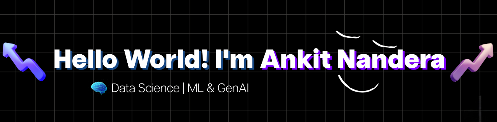

# Hi there 👋🏼, Welcome!
Hello!👋 My name is Ankit Nandera. I’m currently pursuing a B.Tech in Computer Science and Engineering at Shri Vaishnav Vidyapeeth Vishwavidyalaya, located in Indore, India. 🎓

I have a huge interest in coding💻, music🎵, chess♟️, and cricket🏏. Currently diving deep into Machine Learning, AI, and Generative AI to shape my future in tech! 🤖

Currently, I'm an Intern at Infosys Springboard, exploring real-world tech applications and building my professional foundation. 🌱

# 💻 Tech Stack:
              

## 🌐 Socials:
  

<picture>
  <source media="(prefers-color-scheme: dark)" srcset="https://raw.githubusercontent.com/Ankit-Innovates/Ankit-Innovates/output/github-snake-dark.svg" />
  <source media="(prefers-color-scheme: light)" srcset="https://raw.githubusercontent.com/Ankit-Innovates/Ankit-Innovates/output/github-snake.svg" />
  
</picture>
